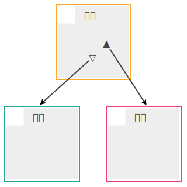
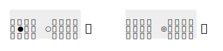
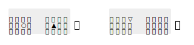
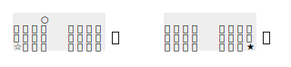

# 紹介

TT-Code (Triple-table T-Code) は、 T-Code におけるテーブルを 1 枚から 3 枚に拡張した入力方式です。このページでは、 T-Code の入力で問題になりうる点に焦点を当て、その 1 つの解決方法として、 TT-Code のアイデアとデザインを紹介します。

## T-Code と外字および補助入力

[T-Code](http://openlab.jp/tcode/) ではキーボードの 40 個のキーを 2 打鍵して 1 字を入力します。したがって、 T-Code の文字配列は、 [40 行 40 列の表](fig.md#t-code-テーブル)で表現することができます。ここではこの表を **テーブル** と呼ぶことにします。

このテーブルには、理論上は 40 × 40 = 1600 種類の文字を収録することができますが、 T-Code ではこのすべてを使用しているわけではなく、現在のところ 1353 字の **基本文字** が定義されています。一方、テーブルに収録されていない文字、すなわち基本文字以外の、 2 打鍵で直接入力できない文字は、 **外字** と呼ばれます。

[Introduction to T-Code](http://openlab.jp/tcode/intro.html) によると、

> 新聞などの記事を入力する際には、入力するべき文字の約95--98%がT-Codeの二打鍵で入力できるといわれています

ということですが、日常的な文章でよく使われる『僕』や『俺』といった文字は T-Code では外字になっています。また、『兄弟』『姉妹』など、初等教育で習うような比較的基本的な学習漢字 (教育漢字) の中にも T-Code の基本文字に含まれないものがあります。

こういった外字を入力するために、 T-Code では、部首合成入力や交ぜ書き変換という専用の補助入力手段が提供されています (というより、もともと T-Code の基本文字集合が、補助入力の存在を前提にして決められているように思われます) 。部首合成入力や交ぜ書き変換は、 T-Code と親和性の高い優れた補助入力ですが、次のような点も指摘できます。

- 交ぜ書き変換は、変換候補を選択し決定するという作業が必要であり、入力のリズムが崩れがちになる
- 部首合成入力は、辞書と変換アルゴリズムによって入力される文字が決定されるため、実装ごとに変換結果が異なることがある
- 部首合成入力や交ぜ書き変換の実装自体が、必ずしも容易ではない
- 部首合成入力では 1 字あたり 6 打鍵を要し、交ぜ書き変換では読みの入力に加えて変換候補の選択・決定を行うためのキー入力が必要になるなど、打鍵数の増加傾向が大きい

ただ、補助入力の問題点を列挙してみましたが、これらは、むしろ逆に、 T-Code の基本部分の設計がそれだけ優れていることの裏返しとも言えるものです。すなわち、 T-Code の基本部分は、

- 変換候補を選択し決定するという作業が不要であり、リズムを崩さず入力できる
- コードから入力される文字が一意に決定される標準的な割り当てがなされている
- 実装が容易である
- 常に 1 字を 2 打鍵で入力する

という特徴をもっています。

また、補助入力は、外字の入力だけでなく、ユーザがまだ習得していない基本文字の入力にも利用できるという側面もあり、学習初期の段階のユーザには不可欠なものとも言えます。しかし、ここでは、すでに T-Code に習熟したユーザを念頭に議論を進めます。

## 基本アイデア

なるべく補助入力に頼らずに入力を行うには、 T-Code の **コード空間** を広げて基本文字集合を大きくするのが素直なアプローチです。

コード空間を広げるためにまず考えられるのは、使用するキーの種類の数を増やしてテーブルのサイズを大きくする方法ですが、それは [T-Code の哲学](note.md#t-code-の哲学)に反することになるので、避けたいところです。

そこで、テーブルのサイズはそのままに、テーブルの数自体を増やす方針をとります。

はじめに述べたように、 T-Code のテーブル 1 枚には理論上は 1600 字、実用上は 1200 字強の文字を割り当てることができます。もしテーブルを 2 枚にすれば 2400 字強の文字を定義することができ、義務教育で習う常用漢字 1945 字 (というのは TT-Code 設計当時の 2003 年時点の数字で、常用漢字はその後 2010 年 11 月 30 日に 2136 字に改訂されました) をすべて収録することができます。さらにテーブルを増やして 3 枚にすれば、収録可能文字数は 3600 字強となり、 JIS X 0208 の第一水準までの漢字をカバーできることになります。

ところで、テーブルの数を増やしたとして、それらの使い分けをどのように指示すればよいでしょうか。

T-Code のテーブルをよく見ると、最も打鍵しやすいと思われる位置にありながら、文字の割り当てられていない **コードポイント** (打鍵位置) が 2 か所あることが分かります。 `jf` と `fj` がそうです。この 2 つを、それぞれ ▲ と ▽ と呼ぶことにします。通常の T-Code では、 ▲ と ▽ には、それぞれ部首合成入力と交ぜ書き変換の機能が割り当てられています。<!-- なお、 T-Code では ▲ と ▽ の打ちやすさは同じではありません。これは [T-Code の非対称性](note.md#t-code-の非対称性)によるものです。 -->

この ▲ と ▽ を、テーブルの指示に用いることを考えます。すなわち、通常の T-Code のテーブルに加えて、新たに 2 枚の **拡張テーブル** (**右表** と **左表** と呼ぶことにします) を定義して、 ▲ を打鍵したときは次の 2 打鍵を右表から参照し、 ▽ を打鍵したときは次の 2 打鍵を左表から参照するようにします。それ以外の場合は、通常の T-Code テーブル (基本表または **本表** と呼ぶことにします) から参照すると決めておきます。こうすることによって、 T-Code の基本部分に手を加えることなく、コード空間を 3 倍に拡張することが可能になります。

ここで ▲ と ▽ は、テーブルを一時的に切りかえるシフト操作にあたると考えられます。ただし、普通のいわゆる Shift キーのような同時打鍵方式ではなく、キーを順次打鍵する逐次方式のシフトです。また、 CapsLock のようなロックシフト (Lock Shift) ではなく、直後の 2 打鍵のみに作用するシングルシフト (Single Shift) です。

## デザイン

上記の基本アイデアをもとに、新しいコード体系の詳細を決めます。

まずは骨格となる入力方式の部分を、次のように定めます。

- T-Code の基本テーブル (本表) に加えて、新たに同じサイズのテーブルを 2 枚 (それぞれ[右表と左表](fig.md#左表と右表)) を定義する
- 本表の 2 つのコードポイント ▲  (`jf`) と ▽  (`fj`) を、それぞれ右表と左表へのシングルシフト操作に割り当てる (それぞれ **右シフト** と **左シフト** と呼ぶ)

次は、この入力方式の上に載せる文字配列です。本表は (部首合成入力と交ぜ書き変換を除き) 通常の T-Code のテーブルと同じものを用います。右表と左表には、それぞれ、本表と同程度の 1200 字強を上限に文字を収録することにし、次のように配列を決めました。

- 右表の 右手 → 左手 の領域 (▲RL) には、学習漢字 (133 字)
- 右表のその他の領域 (▲LL, ▲LR, ▲RR および ▲RL の残り) には、その他の常用漢字 (695 字)
- 左表 (▽LL, ▽LR!, ▽RR, ▽RL!) に、その他の第一水準の漢字 (979 字)
- 以上を、それぞれ JIS コード順に (第一水準の範囲では読みの順に) 配列する

左右表の漢字は、おおむね本表のそれに比べて出現頻度が小さいものなので、本表のような厳密な最適化の必要はなく、むしろ読み順に配列するというように、記憶に対する負担を小さくする方が利益が大きいと考えました。ただし、すべての漢字を同等に扱うのではなく、重要性や必要度の高い順に大きく 3 つのクラス、すなわち、学習漢字・常用漢字・表外漢字、に分け、これらを順に打鍵しやすいコードポイントのブロックに割り当てるという方針です。

また、記号類については、 JIS X 0208 の範囲で次のように定めました。

- `『` `』` `，` `．` `…` の 5 字は、本表の `「` `」` `、` `。` `・` と同じコードポイントで、右表に割り当てる
- その他の記号類は、記述記号・括弧類・一般記号・合成用記号・単位記号・学術記号・罫線素片に分類して右表に割り当てる
- ギリシャ文字・キリル文字・ラテン文字は、左表の空き領域に割り当てる

以上の割り当てにより、 (いわゆる全角・半角の違いを無視して)   JIS X 0208 の第一水準までの全文字をカバーしました。実際の配列は[氷譜](https://yoyuse.github.io/00ttcode/data/ttchart.pdf)で参照できます。比較的低頻度の文字については、読み順や分類順、連想などの構造を取り入れるという、 [T-Code の哲学](note.md#t-code-の哲学)にしたがった配列となっています。

## 落ち穂拾い

### 配列の名前

骨格となる入力方式の枠組み (テーブルを 3 枚用い ▲ と ▽ でシフトする) を、 Triple-table T-Code の略で TT-Code と命名しました。

また、この入力方式の上に載せた具体的な文字配列を、花氷配列と名づけました。

というわけで、当初は、全体として“TT-Code/花氷配列”と呼んでいました。しかし、そもそも TT-Code という名称が、“-Code”を含んでいることから、それ自体、配列も含めた名前だととらえる方が自然かも知れません。

### 部首合成入力と交ぜ書き変換

本表の ▲ と ▽ のコードポイントにもともと定義されていた部首合成入力と交ぜ書き変換は、それぞれ右表と左表の同じコードポイントに割り当てます。ここでは、それぞれ ◆ および ◇ と表記します。

- ◆ (`▲jf`): 部首合成入力
- ◇ (`▽fj`): 交ぜ書き変換

これにより、部首合成入力や交ぜ書き変換はともに 2 打鍵ずつ増加することになりますが、 TT-Code では補助入力の必要性が減少する分、全体としての打鍵数は少なくなることが期待できます。

右表の ▽ にあたるコードポイント (`▲fj`) と、左表の ▲ にあたるコードポイント (`▽jf`) は未定義となっていますが、ここにも何らかの機能を割り当てることが考えられます。たとえば、 `▲fj` に対話的部首合成入力 ■ などを割り当てる、あるいは、前置型の変換と後置型の変換を割り当て分けることも考えられます。

### コードの表示

T-Code では、文字に対応するコードの表示方法に、図示 (**ドット表現**) がしばしば用いられます。これは、コードの第 1 打鍵と第 2 打鍵のキーボード上での位置を ● と ○ で示したものです。第 1 打鍵と第 2 打鍵が同じ位置の場合 (ここでは **重打** と呼びます) は ◎ で表します。例えば、『必 (`sh`)』『要 (`hh`)』は、次のように表示します。

TT-Code では、シフトの種類 (▲ か ▽ か) とシフト先のテーブルでの 2 打鍵 (順に **初打** と **終打** と呼びます) を示せばよいので、 ● を ▲ または ▽ に代えて表示することにします。重打の場合は ▲ または ▽ のみで ○ は表示しません。例えば、『氷 (`jfkd`)』『飴 (`fjrr`)』は、次のように表示します。

## 新常用漢字への対応

### 花氷第三版 (2012-08-01)

2010 年 11 月 30 日に常用漢字が改定されました ([常用漢字 - Wikipedia](https://ja.wikipedia.org/wiki/%E5%B8%B8%E7%94%A8%E6%BC%A2%E5%AD%97))。改定内容は、

- 旧常用漢字 1945 字 - 削除 5 字 + 追加 196 字 = 新常用漢字 2136 字
  - 削除された 5 字は `勺` `錘` `銑` `脹` `匁` (JIS X 0208 第一水準内)
  - 追加された 196 字のうち 30 字は `丼` `傲` `刹` `哺` `喩` `嗅` `嘲` `毀` `彙` `恣` `惧` `慄` `憬` `拉` `摯` `曖` `楷` `鬱` `璧` `瘍` `箋` `籠` `緻` `羞` `訃` `諧` `貪` `踪` `辣` `錮` (JIS X 0208 第二水準内)

となっています。そこで TT-Code には、

- JIS X 0208 第二水準の 30 字 `丼` `傲` `刹` `哺` `喩` `嗅` `嘲` `毀` `彙` `恣` `惧` `慄` `憬` `拉` `摯` `曖` `楷` `鬱` `璧` `瘍` `箋` `籠` `緻` `羞` `訃` `諧` `貪` `踪` `辣` `錮` を
- 左表の ▽RL! の空き領域に
- JIS コード順 (部首順) で

追加で収録することにしました。なお `叱` `填` `剥` `頬` (JIS X 0208 第一水準内) の 4 字は微妙な問題を孕んでいるのですが、とりあえず新常用漢字に含まれるものとして扱います。

## 第二水準の漢字への対応

### TT-code 4.0 (2024-02-21)

TT-Code に未収録の漢字を数えると、

- JIS X 0208 第二水準の漢字は 3390 字
- このうち TT-Code 本表 (つまり T-Code 基本表) に含まれる `已` を除くと 3389 字
- さらに TT-Code 左表に追加した 30 字を除くと 3359 字

となります。一方、 TT-Code の未定義領域は、

- TT-Code 左表に 30 字を追加した残りの空き領域が 39 字分
- TT-Code 左表のラテン文字・ギリシャ文字・キリル文字を割り当てた残りの空き領域が 120 字分
- もし、テーブルをさらに 2 枚増設し、すべてのコードポイントを使用すれば 40 × 40 × 2 = 3200 字分
- 合計で 3359 字分

となり、ぴったり収まることになります。

これが単なる偶然の符合には思えなかったので、第二水準の漢字もすべて収録することを考えました。

さらなる[拡張の方針](fig.md#拡張方針)は、

- 本表の 2 つの未定義のコードポイント `43` と `78` を、それぞれ ☆ (**白シフト**) と ★ (**黒シフト**) とする
- ☆ と ★ からそれぞれ遷移するテーブルを計 2 枚 ([**白表** と **黒表**](fig.md#白表と黒表)と呼ぶ) 新設する
- 左表の空き領域 (39 字分、 120 字分)、白表、黒表の順にコードポイントを使用して
- JIS X 0208 第二水準の漢字 3359 字を JIS コード順 (部首順) に割り当てる

としました。

コードの表示についても、左表・右表と同様に、 ☆ と ★ でそれぞれ白表と黒表を示すことにします。例えば『游ゴシック』の『游 (`43z4`)』や『康熙字典』の『熙 (`78//`)』は、次のように表示します。

これにより TT-code は (いわゆる全角・半角の違いを無視して) JIS X 0208 の全文字をカバーすることになりました。
